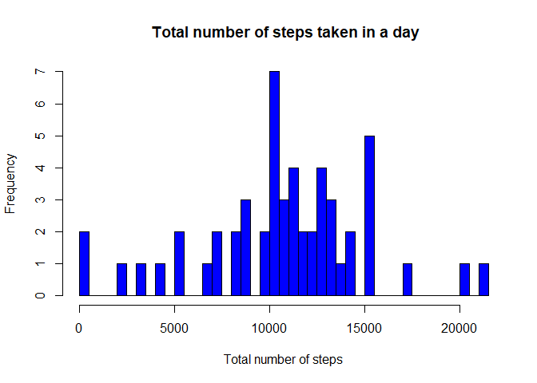
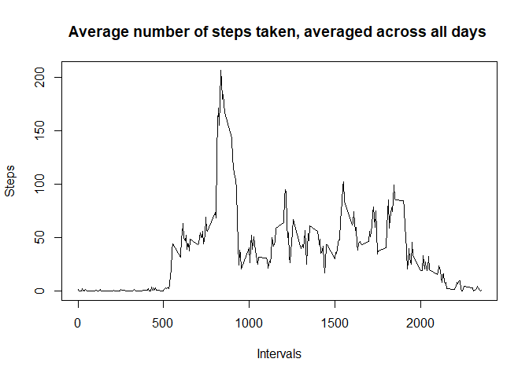
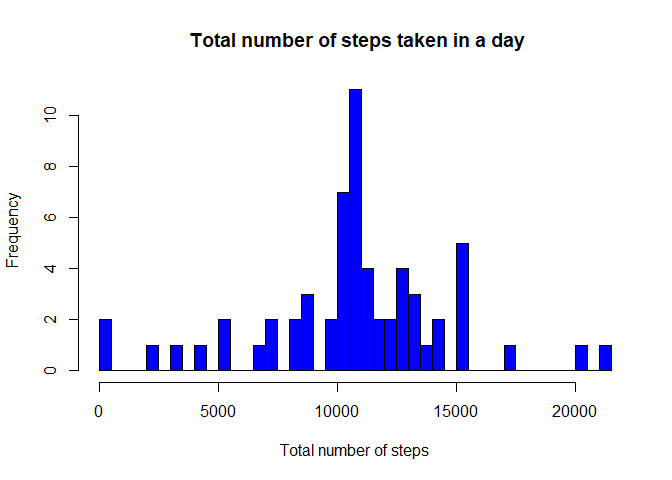
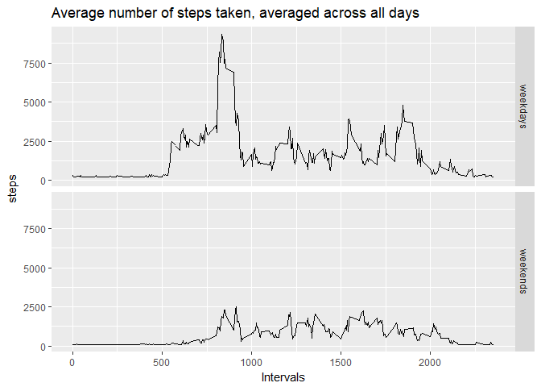

PA1\_template
================
Meenakshi
August 29, 2017

Assignment
----------

This assignment will be described in multiple parts. You will need to write a report that answers the questions detailed below. Ultimately, you will need to complete the entire assignment in a single R markdown document that can be processed by knitr and be transformed into an HTML file.

What is mean total number of steps taken per day?
-------------------------------------------------

### Calculate the total number of steps taken per day

``` r
setwd("C:/Users/meena/Desktop/R")
unzip("repdata%2Fdata%2Factivity.zip")
data <- read.csv("activity.csv")
complete <- data[complete.cases(data), ]
totalsteps <- tapply(complete$steps , complete$date , sum)
df <- as.data.frame.table(totalsteps)
head(df)
```

    ##         Var1  Freq
    ## 1 2012-10-01    NA
    ## 2 2012-10-02   126
    ## 3 2012-10-03 11352
    ## 4 2012-10-04 12116
    ## 5 2012-10-05 13294
    ## 6 2012-10-06 15420

### If you do not understand the difference between a histogram and a barplot, research the difference between them. Make a histogram of the total number of steps taken each day

``` r
hist(totalsteps , main= " Total number of steps taken in a day" , col = "blue" , xlab = "Total number of steps" , breaks = 40 )
```



### Calculate and report the mean and median of the total number of steps taken per dayCalculate and report the mean and median of the total number of steps taken per day

``` r
df0 <- as.data.frame.table(totalsteps)
df0 <- df0[complete.cases(df0), ]
mean <- mean(df0$Freq)
median <- median(df0$Freq)
print(mean)
```

    ## [1] 10766.19

``` r
print(median)
```

    ## [1] 10765

What is the average daily activity pattern?
-------------------------------------------

### Make a time series plot (i.e. type = "l") of the 5-minute interval (x-axis) and the average number of steps taken, averaged across all days (y-axis)

``` r
interval <- tapply(complete$steps , complete$interval , mean)
plot(names(interval) , interval , type = "l" , main = "Average number of steps taken, averaged across all days " , xlab = "Intervals" , ylab = "Steps")
```



### Which 5-minute interval, on average across all the days in the dataset, contains the maximum number of steps?

``` r
df1 <- as.data.frame.table(interval)
maxinterval <- droplevels(df1$Var1[which.max(df1$Freq)])
print(maxinterval)
```

    ## [1] 835
    ## Levels: 835

Imputing missing values
-----------------------

### Calculate and report the total number of missing values in the dataset (i.e. the total number of rows with NAs)

``` r
narows <- !complete.cases(data)
sum(narows)
```

    ## [1] 2304

### Devise a strategy for filling in all of the missing values in the dataset. The strategy does not need to be sophisticated. For example, you could use the mean/median for that day, or the mean for that 5-minute interval, etc.Create a new dataset that is equal to the original dataset but with the missing data filled in.

``` r
new <- read.csv("activity.csv")
new$steps[which(is.na(new$steps))] <- mean(new$steps , na.rm = TRUE)
newtotalsteps <- tapply(new$steps , new$date , sum)
```

### Make a histogram of the total number of steps taken each day and Calculate and report the mean and median total number of steps taken per day. Do these values differ from the estimates from the first part of the assignment? What is the impact of imputing missing data on the estimates of the total daily number of steps?

``` r
hist(newtotalsteps , main= " Total number of steps taken in a day" , col = "blue" , xlab = "Total number of steps" , breaks = 40 )
```



``` r
df2 <- as.data.frame.table(totalsteps)
df2 <- df0[complete.cases(df0), ]
newmean <- mean(df2$Freq)
newmedian <- median(df2$Freq)
print(newmean)
```

    ## [1] 10766.19

``` r
print(newmedian)
```

    ## [1] 10765

Are there differences in activity patterns between weekdays and weekends?
-------------------------------------------------------------------------

### Create a new factor variable in the dataset with two levels - "weekday" and "weekend" indicating whether a given date is a weekday or weekend day.

``` r
library(ggplot2)
new$days <- weekdays(as.Date(new$date))
new$days[new$days %in% c('Saturday' , 'Sunday')] <- "weekends"
new$days[new$days != "weekends"] <- "weekdays"
head <- head(new)
print(head)
```

    ##     steps       date interval     days
    ## 1 37.3826 2012-10-01        0 weekdays
    ## 2 37.3826 2012-10-01        5 weekdays
    ## 3 37.3826 2012-10-01       10 weekdays
    ## 4 37.3826 2012-10-01       15 weekdays
    ## 5 37.3826 2012-10-01       20 weekdays
    ## 6 37.3826 2012-10-01       25 weekdays

### Make a panel plot containing a time series plot (i.e. type = "l") of the 5-minute interval (x-axis) and the average number of steps taken, averaged across all weekday days or weekend days (y-axis). See the README file in the GitHub repository to see an example of what this plot should look like using simulated data.

``` r
t <- aggregate(steps~interval+days , new , sum )
qplot(interval , steps , data = t , facets =days~. , geom = "line" , xlab = "Intervals" , ylab = "steps" , main = "Average number of steps taken, averaged across all days" )
```


